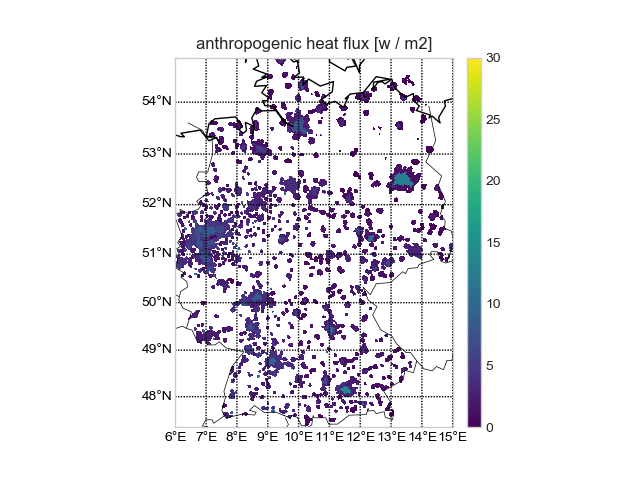
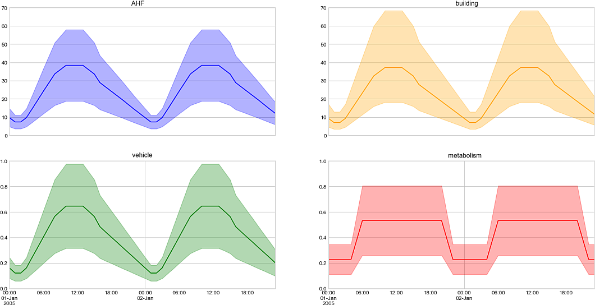

# LUCY Postproc 
LUCY Postproc is a simple Python interface to analyze and visualize the outputs of the LUCY (**L**arge Scale **U**rban **C**onsumption of Energ**Y**) model.

A detailed description of the LUCY model can be found in Allen et al. (2011) and Lindberg et al. (2013).

+ Allen L, F Lindberg, CSB Grimmond (2011) Global to city scale model for anthropogenic heat flux, International Journal of Climatology, 31, 1990-2005. https://doi.org/10.1002/joc.2210
+ Lindberg F, Grimmond CSB, Nithiandamdan Y, Kotthaus S, Allen L (2013) Impact of city changes and weather on anthropogenic heat flux in Europe 1995–2015, Urban Climate, 4, 1-15. http://dx.doi.org/10.1016/j.uclim.2013.03.002

## Screenshots:

## Table of Contents

+ [General Information](#General-Information) 
+ [Installation](#Installation)
+ [Examples](#Examples)

  

## General Information

LUCY Postproc provides basic classes to work with *spatial* and *temporal* (time series) anthropogenic heat flux (AHF) data that LUCY model produces. The postprocessing framework provides a plotting utility to make quick plots. For more in depth analysis, it provides functions to convert ASCII model data to NumPy arrays and Pandas data frame. 

Several example codes are given to demonstrate the usage of the library.

## Installation

No special installation script is required. You only need to import the file **lucy_postproc.py** from your Python script. You need NumPy, Matplotlib, Pandas (0.24.0 or higher) installed on your system.

## Examples

The following code samples to illustrate how the library can be used:

* **test_spatial.py:** minimal working example to plot spatial data
* **test_timeseries.py:** minimal working example to plot time series data
* **test_spatial_cmd.py:** similar to test_spatial.py but the file is read as a command-line argument.
* **plot_spatial_custom.py:** more complicated spatial plotting and analysis. Data is converted to NumPy arrays and Matplotlib & Basemap are used plot the AHF data.
* **plot_statistics.py:** analysis and plotting of the time series data using Pandas data frames and Matplotlib.
* **batch_plot.py:** minimal script to make sequential batch plots of AHF data. A sample ImageMagick command is also provided to make a gif animation.

